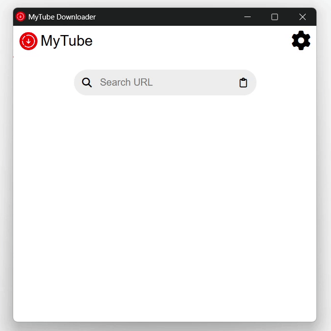
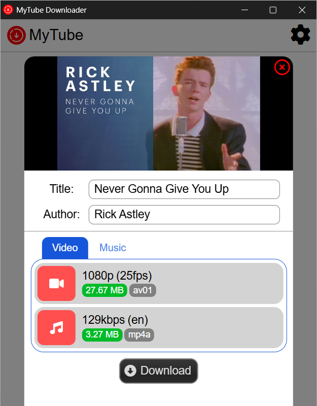
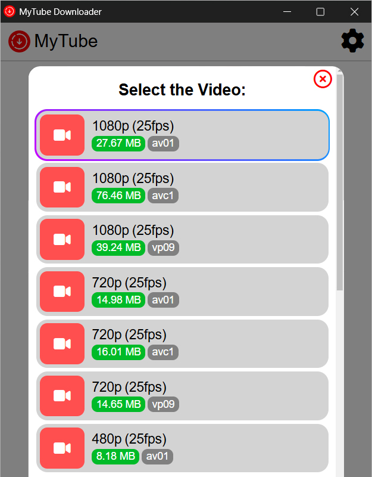

<h1 align="center">MyTube GUI</h1>
<h3 align="center">YouTube Media Downloader</h3>

    (User Interface for <a href="https://github.com/SuperZombi/MyTube">MyTube</a>)

    

     
     
    

    

    
<h2>Screenshots</h2>

    

        
        
    

    

        
    

## Advantages:
* Choice of video and audio streams in high quality.
* Choice of language of audio streams.
* Authorization for accessing age-restricted and account-required content.

## 💲Donate
<table>
  <tr>
    <td>
       
    </td>
    <td>
      <a href="https://donatello.to/super_zombi">Donatello</a>
    </td>
  </tr>
  <tr>
    <td>
       
    </td>
    <td>
      <a href="https://www.donationalerts.com/r/super_zombi">Donation Alerts</a>
    </td>
  </tr>
</table>
